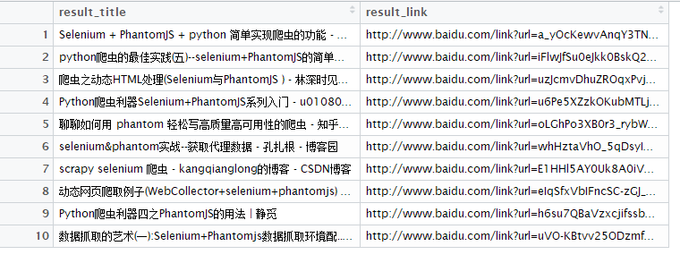
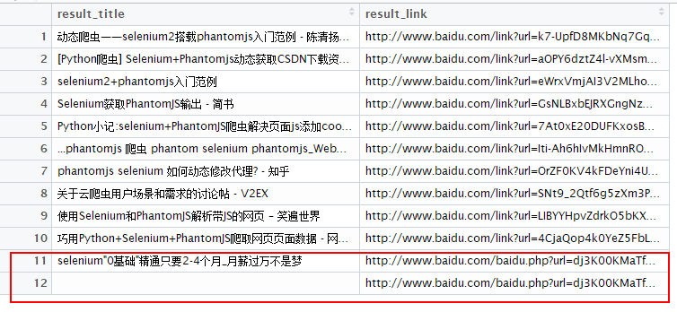

# Selenium + phantomjs + R 动态网页抓取

## warm up

主要的原理是是利用`selenium server`驱动`phantomjs`无头浏览器来解析网页，这样就能解析哪些js返回的东西，因为它本身就是浏览器。

## path

1. 跑通 [get_imgs_from_flickr_1.R](get_imgs_from_flickr_1.R)
2. 通过学习 [something_fun_download_wallpapers.R](something_fun_download_wallpapers.R)例子，能自定义抓取自己想要的图片
3. 通过学习 [sth_fun_baidu_click_search.R](sth_fun_baidu_click_search.R)例子，能模拟基本的浏览器点击
4. 高阶：phantomjs 可以注入js脚本，这个需要会写js,官方例子 <http://phantomjs.org/quick-start.html> （暂时没有时间研究）

## some result

[sth_fun_baidu_click_search.R](sth_fun_baidu_click_search.R)例子，通过模拟点击搜索，得到的结果：

第二页可以看到注入了两个广告。。

## 暂时先这样，有兴趣的同学自己研究吧。。。

